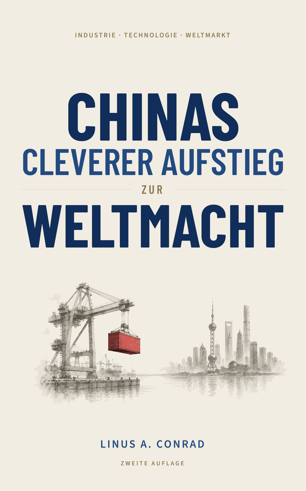

# Chinas cleverer Aufstieg zur Weltmacht — Website

<p align="center">
  
</p>

<p align="center">
  <strong>Industrie · Technologie · Weltmarkt</strong><br>
  Zweite Auflage ·
  <a href="https://lenniaconrad.github.io/chinas-cleverer-aufstieg/index.html">Website öffnen</a>
</p>

## Über das Buch

*Chinas cleverer Aufstieg zur Weltmacht* zeigt, wie Reformen, Unternehmen,
wirtschaftliche Koordination und Weltmarkt gemeinsam industrielle Fähigkeiten
entstehen ließen. Die Website ergänzt das Buch um eine Leseprobe und einen
interaktiven Datenbegleiter.

Das Buch ist bei Amazon.de als
[Kindle-Ausgabe](https://www.amazon.de/dp/B0HF1M9J4R),
[Taschenbuch](https://www.amazon.de/dp/B0HF1WFNK3) und
[Hardcover](https://www.amazon.de/dp/B0HF1NMTRQ) erhältlich. Die
[PDF-Leseprobe](assets/chinas-aufstieg-leseprobe.pdf) kann ohne Anmeldung
geöffnet werden.

## Über den Autor

Linus A. Conrad studiert an der Beijing Language and Culture University. Er ist
in Deutschland aufgewachsen, hat einen schweizerischen Familienhintergrund und
lebt in Peking. Seine Interessen gelten der industriellen Entwicklung Chinas
und den strukturellen Verschiebungen der Weltwirtschaft.

## Bestandteile

- [`index.html`](index.html): Startseite mit Buchpositionierung, Autorprofil und
  Ausgabenübersicht
- [`daten/`](daten/): interaktiver Datenbegleiter mit sechs Datensätzen
- [`assets/site.css`](assets/site.css): gemeinsames Layout, Typografie und
  responsive Komponenten
- [`assets/site.js`](assets/site.js): Navigation und die Markierung des
  aktiven Datensatzes im Datenbegleiter
- [`assets/autor-portraet.jpg`](assets/autor-portraet.jpg): Autorenporträt für
  den Profilabschnitt
- [`assets/chinas-aufstieg-leseprobe.pdf`](assets/chinas-aufstieg-leseprobe.pdf):
  PDF-Leseprobe, Seite für Seite aus dem gesetzten Hardcover-Manuskript
  (`chinas-aufstieg_hardcover_manuscript.pdf`) entnommen
- `assets/qr-*.png`: QR-Codes für die drei Amazon-Ausgaben

## Lokale Vorschau

```bash
python3 -m http.server 8765
```

Dann `http://127.0.0.1:8765/` öffnen.

## Hinweise

- Die Website ist buildfrei und für statisches Hosting ausgelegt.
- Schriften und Medien werden lokal ausgeliefert.
- Ein durchgehender Papierton trägt alle Seiten; gegliedert wird über Linien,
  Typografie und Weißraum statt über wechselnde Farbflächen.
- Bewegung gibt es nur dort, wo sie eine Funktion hat (Diagramm-Interaktion,
  Sprungziele); Interaktionen bleiben tastaturbedienbar.
